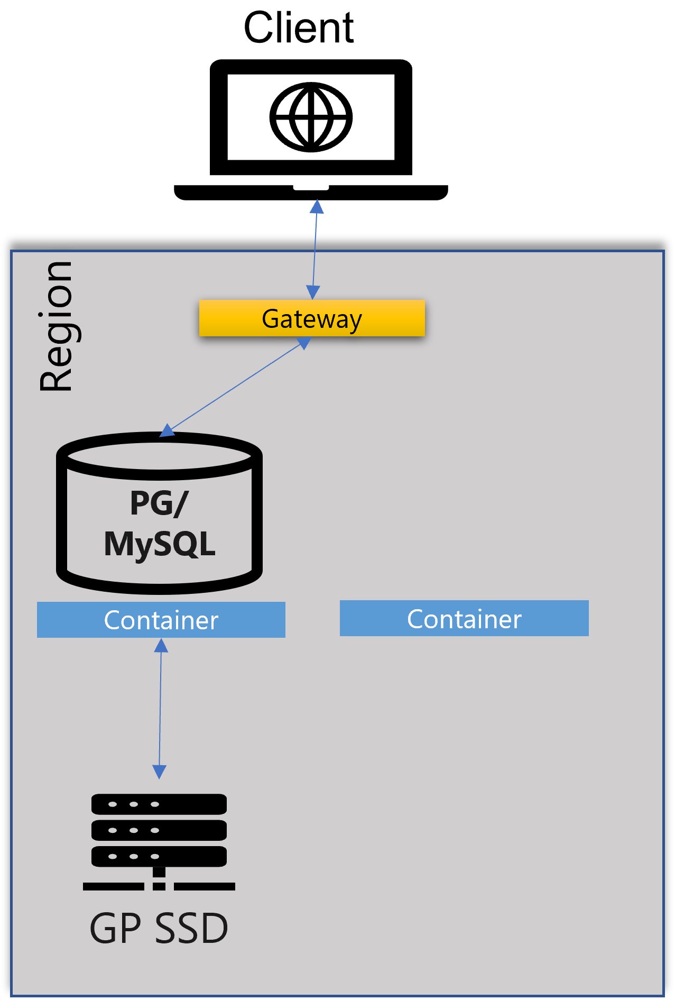
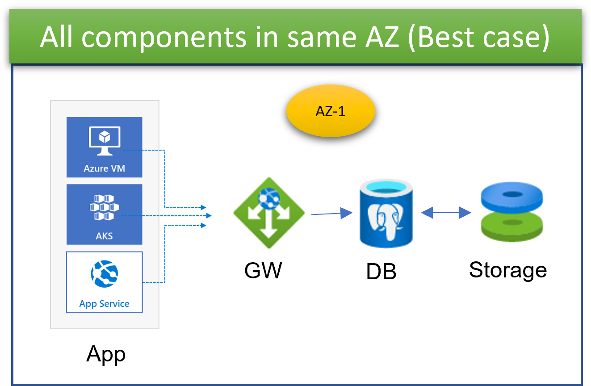
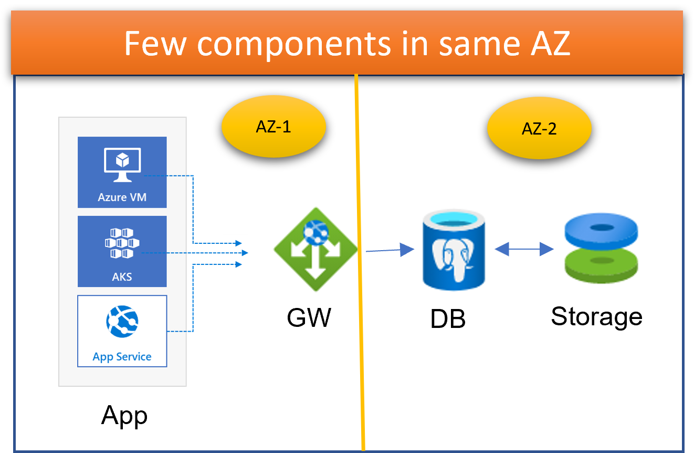
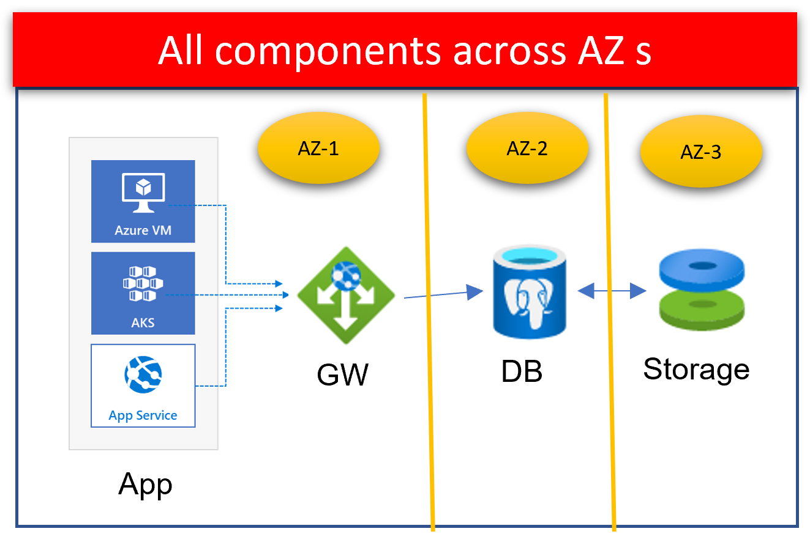
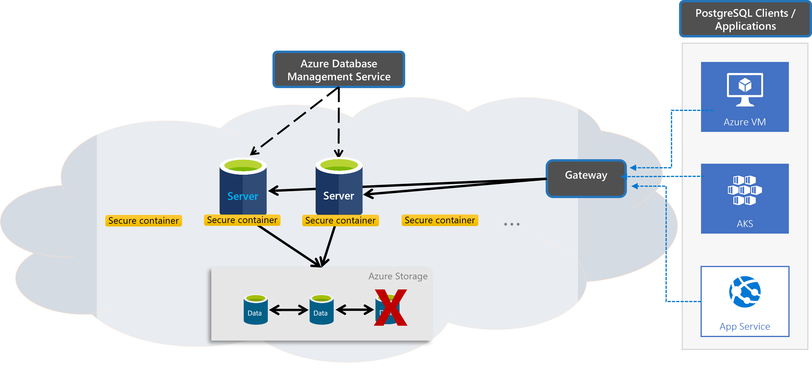
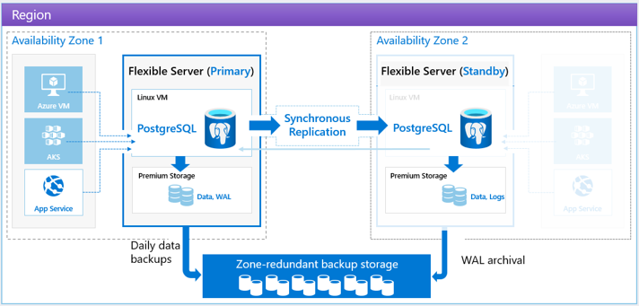

# Overview (Azure Database for PostgreSQL Single Server and Flexible Server)

## Single Server Overview and challenges



### Built for 
- Availability
- Elasticity
- Security
- Integration in ecosystem
- Industry leading TCO

### Notable Facts
- Generally available in 2018
- Significant growth YoY
- Many Tier-1 workloads

## Challenges
### 1. Application Latency







#### Key Points
- Limited control on resource placement
- Once deployed, the compute placement can change due to scale operations or any failures

#### Key Challenges
- Connection through Gateway
- No Availability zone locality or choice

#### Learnings
- Eliminate gateway
- Provide AZ colocation with application


### 2. Connections
Example of connections command:
```bash
psql "host=mydb-pg11.postgres.database.azure.com port=5432 dbname=postgres user=sr@mydb-pg11 password=myPassword sslmode=require"
```
#### Key Points
- Not a regular Postgres username
- Recommended to use connection pooling – like PgBouncer for Postgres
- Connection retry logic should have back off logic

#### Key Challenges
- Connection requires - <username>@servername 
- Establishing a new connection is expensive
- Limits with # of connections per SKU

#### Learnings
- Remove @<servername>
- Reduce time to establish new connection
- Provide managed connection pooler

### 3. Maintenance window

#### Key Points
- Fully system controlled 
- Customers cannot choose the timing
- Advanced Notification 72 hours. 
- Total span time 15 hours (5 pm to 8 am) but actual maintenance for a server (minutes)

#### Challenge
- Customer has limited to no control to align maintenance to their workload patterns

#### Learnings
- Provide customer-controlled maintenance window

### 4. High Availability


#### Key Features
- Region-level resiliency for compute failure 
- AZ-level resiliency with storage failure with 3 copies

#### Challenge
- Failure of AZ where storage is provisioned can lead to downtime

#### Learnings
- Provide AZ selection
- Provide AZ resilient HA with Automatic failover with no data loss

### Challenges Summary
#### Latency
- AZ Colocation, no Gateway offers low latency

#### Connections
- Configure up to 5000 connections. 
- Connection string does not require @server as part of username. 
- Includes built-in connection pooler PgBouncer

#### Maintenance window 
- Can be customer controlled 
- Availability Zone 
- Resiliency with zone-redundant HA

#### Additional Value
+ Linux-based deployment 
+ Improved out-of-box performance.


## Flexible Server (Strategic choice of service)



Addresses Single Server shortcomings

### Latency
- AZ Colocation, no Gateway offers low latency

### Connections
- Configure up to 5000 connections.
- Built-in connection pool feature 
- Connection string does not require __@server__ as part of username. 

### Maintenance window 
- Can be __customer controlled__ 

### Availability Zone 
- Resiliency with __zone-redundant HA__
- __Linux-based__ deployment 
- New __major versions__
- Improved out-of-box __performance__

### Frequency asked Closed network deployment
- [Private Link for Azure Database for PostgreSQL-Single server](https://learn.microsoft.com/en-us/azure/postgresql/single-server/concepts-data-access-and-security-private-link)
- [Private access (VNet integration)](https://learn.microsoft.com/en-us/azure/postgresql/flexible-server/concepts-networking#private-access-vnet-integration)
- [Private Networking Patterns in Azure Database for Postgres Flexible Server](https://techcommunity.microsoft.com/t5/azure-database-for-postgresql/private-networking-patterns-in-azure-database-for-postgres/ba-p/3007149)


## Summary of Single Server and Flexible Server

[Comparison chart - Azure Database for PostgreSQL Single Server and Flexible Server](https://learn.microsoft.com/en-us/azure/postgresql/flexible-server/concepts-compare-single-server-flexible-server)

- Username in connections string requires to modify application code.
- Both lc_collate and lc_ctype effects sorting results.
- [Read replica is currently public preview](https://learn.microsoft.com/en-us/azure/postgresql/flexible-server/concepts-read-replicas)
- [Azure Active Directory Support(AAD) is currently public preview](https://learn.microsoft.com/en-us/azure/postgresql/flexible-server/concepts-azure-ad-authentication)
- [Customer managed encryption key(BYOK) is currently public preview](https://learn.microsoft.com/en-us/azure/postgresql/flexible-server/concepts-data-encryption)
- Microsoft Defender for Cloud is not supported yet but we have roadmap.
- Azure Backup recovery service vault is not supported yet but we have roadmap.