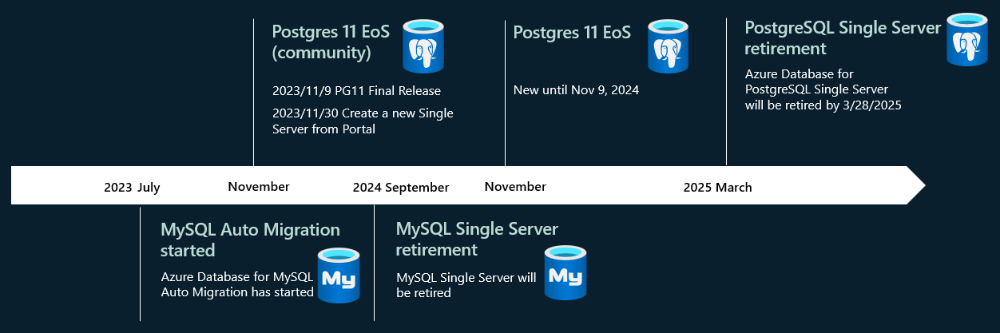
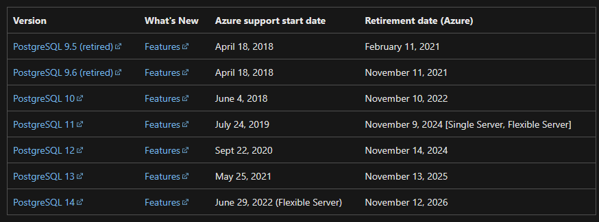

# Azure Database for PostgreSQL Single Server Milestone

## PostgreSQL 11 support in Single Server and Flexible Server

### Azure is extending support for PostgreSQL 11 in Single Server and Flexible Server by one more year until November 9, 2024.

- You will be able to create and use your PostgreSQL 11 servers until November 9, 2024 without any restrictions. This extended support is provided to help you with more time to plan and migrate to Flexible server for higher PostgreSQL versions.
- Until November 9, 2023, Azure will continue to update your PostgreSQL 11 server with PostgreSQL community provided minor versions.
- Between November 9, 2023 and November 9, 2024, you can continue to use your PostgreSQL 11 servers and create new PostgreSQL servers without any restrictions. However, other retired PostgreSQL engine restrictions apply.
- Beyond Nov 9 2024, all retired PostgreSQL engine restrictions apply.

## Major version retirement policy.

### The table below provides the retirement details for PostgreSQL major versions. The dates follow the [PostgreSQL community versioning policy](https://www.postgresql.org/support/versioning/).

