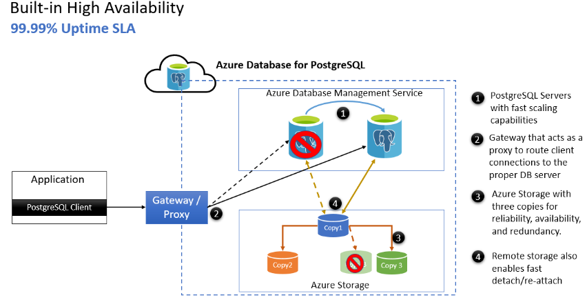
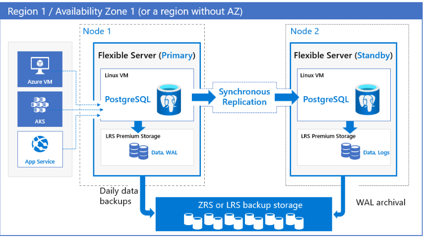

# Comparison Chart - Azure Database for PostgreSQL Single Server and Flexible Server

Azure Database for PostgreSQL Flexible Server is the next generation managed PostgreSQL service in Azure. It provides maximum flexibility over your database, built-in cost-optimizations, and offers several improvements over Single Server

## Feature Comparison

### Comparison Table

|Function|Sinlgle Server|Flexible Server|
|--------|--------------|---------------|
|Foundation OS|Windows|Linux|
|Zone-Redundant|No|Yes|
|pgBouncer|No|Yes|
|Maintenance Window|System schedule only|System or custom schedule|
|Stop/Start|No|Yes(Compute Only)|
|Connection String|<user_name>@server_name| Username Only|
|Locale/Collation|English_United States.1252|en_US.utf8|
|Connection Port|5432|5432（DB）, 6432(PgBouncer)|
|Maximum connections|1982|5000|
|Network|Public, Private Links|PUBLIC, VNET INJECTION, PRIVATE LINKS (PREVIEW)|
|High Availability|Built-in HA(Single-AZ) 99.99%|Non-HA 99.9% Same Zone HA 99.95% Zone-redundant HA 99.99%|

- Detail Reference Table for Comparison. [Reference Document](https://learn.microsoft.com/en-us/azure/postgresql/flexible-server/concepts-compare-single-server-flexible-server#comparison-table)

## High Availability Architecture

### Single Server

- [High availability in Azure Database for PostgreSQL – Single Server](https://learn.microsoft.com/en-us/azure/postgresql/single-server/concepts-high-availability)

### Flexible Server

- [High availability concepts in Azure Database for PostgreSQL - Flexible Server](https://learn.microsoft.com/en-us/azure/postgresql/flexible-server/concepts-high-availability)
